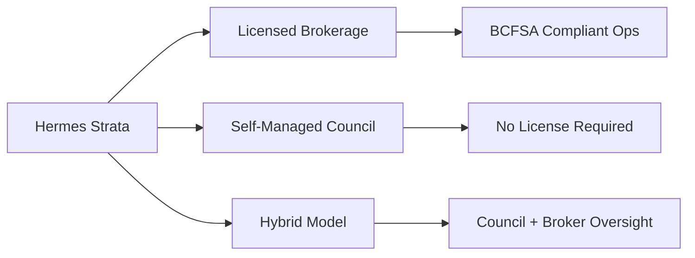

# Hermes Strata — Roadmap & Paths

---

## Go-To-Market Paths

| Path | License | Hermes Role | Revenue |
|------|---------|-------------|---------|
| Licensed Brokerage | BCFSA brokerage + Managing Broker | White-label ops platform | $4–6/unit × portfolio |
| Self-Managed | None (owners manage themselves) | Direct SaaS | $4/unit or $200/bldg flat |
| Hybrid | Broker for trust/forms only | Council day-to-day + broker oversight | Split pricing |

---

## Timeline

### Phase 1 — Foundation ✅ (Jul 2026)
Marketing site, compliance KB, Strata Tool hub, docs, graphs

### Phase 2 — Supercharge (Jul–Aug 2026)
About page, roadmap, building template wizard, e-transfer prototype

### Phase 3 — Core Product (Q3 2026)
Docker stack, trust ledger, fee billing, Form B/F API, bylaw state machine, PWA

### Phase 4 — Sovereign (Q4 2026)
Satohash integration, Lightning, Nostr identity, multisig watch, CRT export

### Phase 5 — Scale (2027)
Brokerage multi-building, bank feeds, war chest, agent pay, ON/AB packs

### Phase 6 — International (2028)
US HOA (WA, FL, CA), EU multi-language, OpenStrata protocol adoption

---

## Jurisdiction Expansion

| Order | Region | Law Pack | Status |
|-------|--------|----------|--------|
| 1 | BC | SPA, RTA, EPR | **Live** |
| 2 | ON | Condo Act | Planned |
| 3 | AB | Condo Act | Planned |
| 4 | US-WA | RCW 64.34 | Planned |
| 5 | US-FL/CA | HOA/CC&R | Planned |
| 6 | EU | Multi-lang | Planned |

Config-driven via `config.yaml` — one codebase, swap law packs.

---

## Integration Dependencies

| Partner | Status | Integration Point |
|---------|--------|-------------------|
| Satohash | In progress (v4.1) | OTS stamping API |
| OpenStrata | Spec phase | Nostr export format |
| Umbrel/Tailscale | Ready | Local-first hosting |
| Unchained/Casa | Future | Multisig provider option |
| BCFSA | N/A (regulator) | Audit-ready exports |

---
**Diligence pack:** [docs/diligence/](../diligence/) (investor + architecture + ask)
